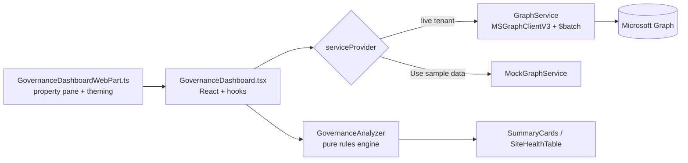

# SharePoint Governance Dashboard

A **SharePoint Framework (SPFx)** client-side web part that queries the **Microsoft Graph API** to surface tenant governance signals on a single pane of glass: **stale sites, inactive sites, storage pressure, and ownership / permission anomalies**.

Built to support a real SharePoint governance program — identify risk, prioritise clean-up, and keep the estate healthy — and to demonstrate end-to-end M365 development: Graph data access, a typed service layer, a tested rules engine, and a themed Fluent UI experience.


> 📸 _Add a screenshot at `docs/dashboard.png` once you run the web part in the workbench — the README references it below._
>
> 

---

## What it surfaces

| Signal | Source | Default rule |
| --- | --- | --- |
| **Stale sites** | `getSharePointSiteUsageDetail` → last activity date | No activity for ≥ **90 days** |
| **Inactive sites** | same report (or no activity in window) | No activity for ≥ **180 days** |
| **Storage at risk** | usage report → used / allocated bytes | ≥ **75%** (warning) / ≥ **90%** (critical) of quota |
| **Orphaned sites** | group `owners` | **0 owners** on the connected M365 group |
| **Single point of failure** | group `owners` | fewer than **2 owners** |
| **External access** | group `members` (`userType eq 'Guest'`) | one or more guest members |

Every threshold is configurable from the web part **property pane** — no redeploy required.

---

## Architecture



**Design principles**

- **Transport-agnostic UI.** The React layer depends on the `IGraphService` interface, never on Graph directly. A `MockGraphService` lets the web part be demoed in the local workbench (or by a reviewer) with **no admin consent required** — just leave _Use sample data_ on.
- **Pure rules engine.** `GovernanceAnalyzer` has zero React/Graph dependencies, so the governance logic is fully unit tested (see [`GovernanceAnalyzer.test.ts`](src/webparts/governanceDashboard/services/GovernanceAnalyzer.test.ts)).
- **Batched Graph calls.** Ownership/guest signals are fetched through Graph `$batch` (20 requests per call) to stay inside throttling limits.

---

## Microsoft Graph permissions

Declared in [`config/package-solution.json`](config/package-solution.json) as `webApiPermissionRequests`. After deploying the package, a tenant admin approves these once from **SharePoint admin center → Advanced → API access**:

| Scope | Used for |
| --- | --- |
| `Reports.Read.All` | SharePoint site usage detail report |
| `Sites.Read.All` | Site metadata |
| `Group.Read.All` | Enumerate Microsoft 365 groups + backing sites |
| `GroupMember.Read.All` | Owner and guest counts |
| `User.Read.All` | Resolve `userType` (guest detection) |

> **Note:** tenant-level usage reports return de-identified site names unless _"Make report data identifiable"_ is enabled in **Microsoft 365 admin center → Settings → Org settings → Reports**.

---

## Getting started

### Prerequisites

- **Node.js 18.17.1+ (18.x LTS)** — SPFx 1.20 does not support newer majors. Use [nvm-windows](https://github.com/coreybutler/nvm-windows): `nvm install 18.17.1 && nvm use 18.17.1`.
- Gulp CLI: `npm install -g gulp-cli`
- A Microsoft 365 tenant with the SharePoint **App Catalog** provisioned (for deployment only).

### Install & run in the workbench

```bash
npm install
npm run serve
```

Then open the hosted workbench (set your site in `config/serve.json`):
`https://<your-tenant>.sharepoint.com/_layouts/workbench.aspx`

Drop the web part on the page. It starts in **sample-data mode**, so it renders immediately without any Graph permissions.

### Run the tests

```bash
npm test       # Jest unit tests for the governance rules engine
npm run lint   # ESLint (SPFx + React profile)
```

### Package & deploy

```bash
npm run package
```

This produces `sharepoint/solution/spfx-governance-dashboard.sppkg`. Upload it to your tenant App Catalog, then approve the Graph permission requests in the SharePoint admin center.

---

## Property pane settings

| Setting | Default | Notes |
| --- | --- | --- |
| Dashboard title | _SharePoint Governance Dashboard_ | Free text |
| Use sample data | On | Off = query the live tenant via Graph |
| Usage reporting period | D30 | D7 / D30 / D90 / D180 |
| Max groups to scan | 200 | Bounds the `$batch` ownership scan |
| Stale / Inactive after (days) | 90 / 180 | Activity thresholds |
| Storage warning / critical (%) | 75 / 90 | Quota thresholds |
| Minimum owners per site | 2 | Below this = single point of failure |

---

## Project structure

```
src/webparts/governanceDashboard
├── GovernanceDashboardWebPart.ts        # Web part shell: property pane, theming, DI
├── GovernanceDashboardWebPart.manifest.json
├── components/                          # React (functional + hooks) + Fluent UI
│   ├── GovernanceDashboard.tsx          # Orchestration: fetch → analyze → render
│   ├── SummaryCards.tsx
│   ├── HealthFilters.tsx
│   └── SiteHealthTable.tsx
├── models/                              # Domain types + thresholds
├── services/
│   ├── IGraphService.ts                 # Transport abstraction
│   ├── GraphService.ts                  # Live Microsoft Graph (MSGraphClientV3 + $batch)
│   ├── MockGraphService.ts              # Sample data
│   ├── GovernanceAnalyzer.ts            # Pure rules engine
│   └── GovernanceAnalyzer.test.ts       # Unit tests
└── loc/                                 # Localised property-pane strings
```

See [`docs/ARCHITECTURE.md`](docs/ARCHITECTURE.md) for a deeper walkthrough.

---

## Roadmap

- Export the current view to CSV / Excel.
- Drill-through per site (sharing links, recent sharing events).
- Sensitivity-label and retention-policy coverage signals.
- Scheduled email digest via a companion Azure Function.

---

## License

[MIT](LICENSE) © Mark Makhoul
